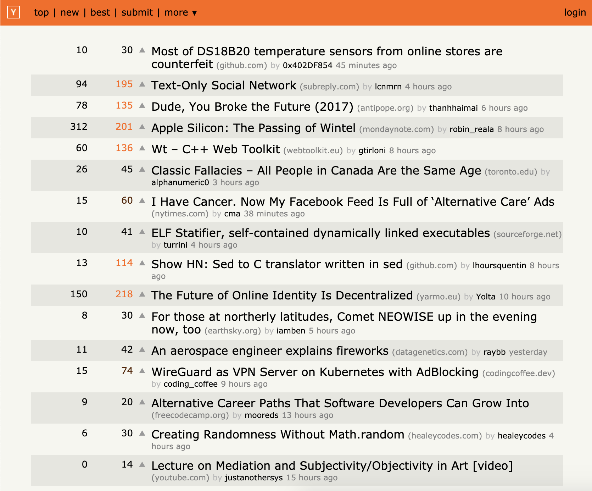

# Hacker News Reader

> News reader app that displays the latest [Hacker News](http://news.ycombinator.com/) stories via [their API](https://github.com/HackerNews/API).

[Demo site](https://alebelcor.github.io/hacker-news-reader/)



Note: UI was based off of [Hacker News Enhancement Suite](https://github.com/etcet/HNES) (browser extension).

## Requirements

- [Node.js](https://nodejs.org/) 12+
- [Yarn v1](https://classic.yarnpkg.com/)

Note: You may also use [npm](https://www.npmjs.com/), instead of Yarn, if you want.

## Usage

### Install dependencies

```bash
yarn # or `npm install`
```

### Start a development server

```bash
yarn start # or `npm start`
```

### Run tests

```bash
yarn test # or `npm test`
```

### Lint files

```bash
yarn lint # or `npm run lint`
```
